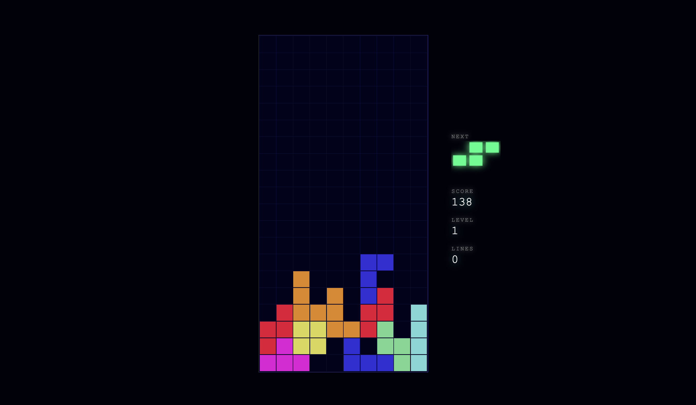

# tetris-threejs

A neon-styled Tetris clone built with Three.js and TypeScript. Features glowing blocks, bloom post-processing, ghost piece preview, and classic gameplay mechanics.



## Play

```bash
npm install
npm run dev
```

Open `http://localhost:5173` in your browser.

## Controls

| Key | Action |
|-----|--------|
| Arrow Left / Right | Move piece |
| Arrow Down | Soft drop |
| Space | Hard drop |
| Arrow Up / Z | Rotate clockwise |
| X | Rotate counter-clockwise |
| P | Pause / Resume |
| Enter | Start / Restart |

## Features

- All 7 tetrominoes with SRS (Super Rotation System) wall kicks
- NES-style scoring with level progression
- Ghost piece showing drop position
- Next piece preview
- Neon glow effect with UnrealBloomPass
- DAS (Delayed Auto Shift) for smooth movement
- 7-bag randomizer for fair piece distribution

## Tech Stack

- **Three.js** — 3D rendering with bloom post-processing
- **TypeScript** — type-safe game logic
- **Vite** — dev server and build tooling

## Architecture

Game logic is fully separated from rendering — `game.ts`, `board.ts`, and `tetromino.ts` are pure data with no Three.js dependency. The renderer reads game state each frame and updates meshes accordingly.

## License

MIT
